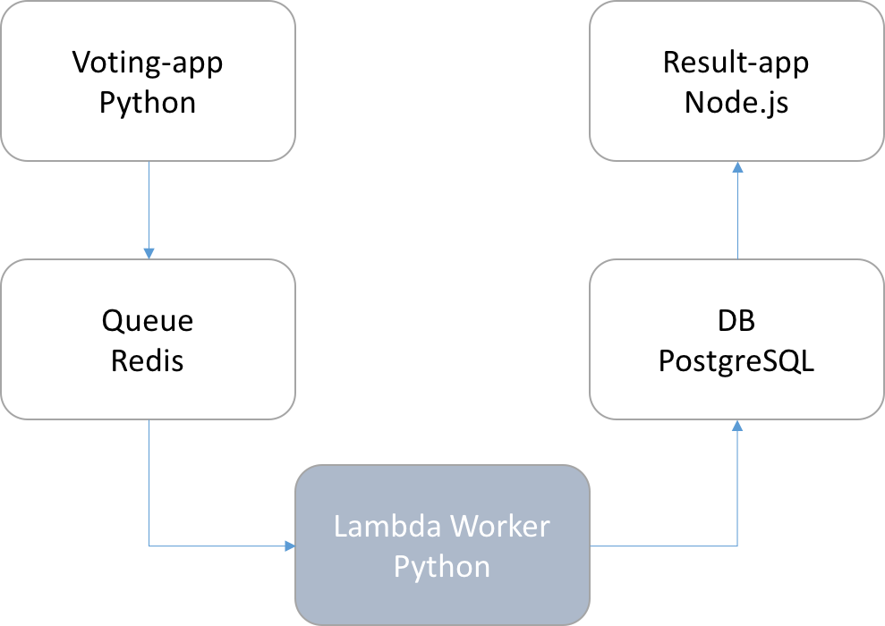

Voting App
=========
This repository contain the WORKER part of the complete voting application
* Result part: [https://github.com/CYYG/catvsdog-worker](https://github.com/CYYG/catvsdog-worker)
* Vote part: [https://github.com/CYYG/catvsdog-vote](https://github.com/CYYG/catvsdog-vote)
* Lambda Worker: [https://github.com/CYYG/catvsdog-result](https://github.com/CYYG/catvsdog-result)
* Terraform: [https://github.com/ralbon/AWS-BBL-Infra](https://github.com/ralbon/AWS-BBL-Infra)

Getting started
---------------
This code is designed for Lambda execution, it contains its own Redis and Postgres packages.

Architecture
-----

* A Python webapp which lets you vote between two options (THIS REPO)
* A Redis queue which collects new votes
* **A Python worker (designed for lambda) which consumes votes and stores them in… (THIS REPO)**
* A Postgres database backed by a Docker volume
* A Node.js webapp which shows the results of the voting in real time

Note
----

The voting application only accepts one vote per client. It does not register votes if a vote has already been submitted from a client.
